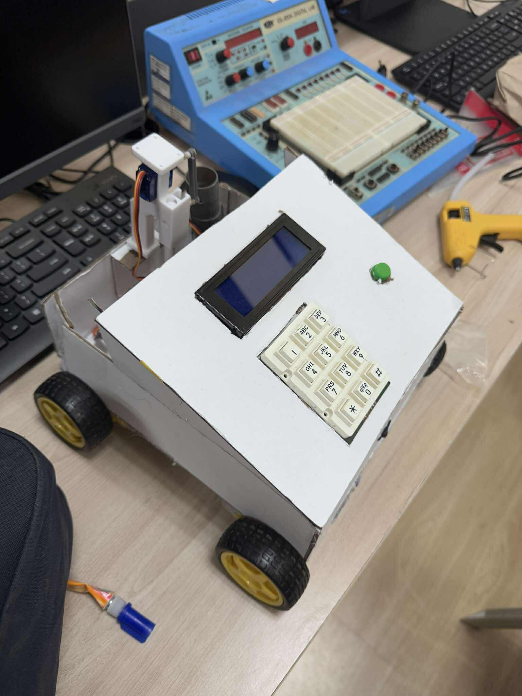
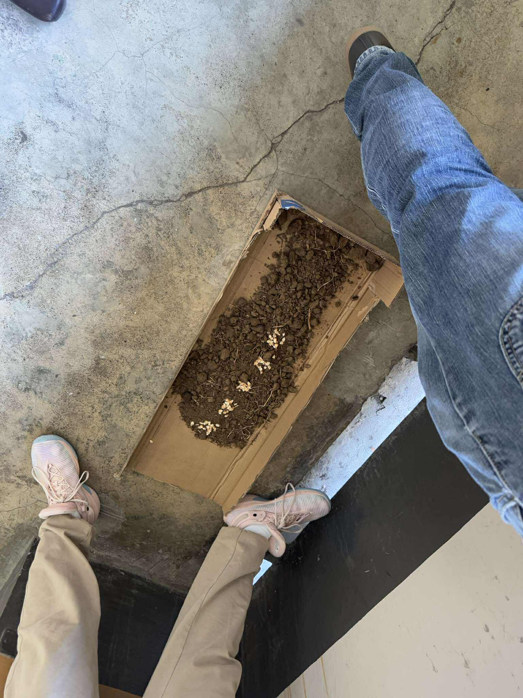

# MCU-Based Seed Sowing Robot

An autonomous, microcontroller-based robot designed to automate seed planting with precision and efficiency. Powered by the PIC16F877A microcontroller, this robot plows soil, dispenses seeds, and tracks distance to ensure optimal seed placement for small-scale farmers.

## 📚 Project Overview

The **Seed Sowing Robot** addresses the global need for efficient and sustainable agricultural practices. As food demand rises and labor resources shrink, this robot offers a low-cost solution to automate one of farming’s most labor-intensive tasks: seed planting.

Features include:

- Autonomous navigation on flat fields
- Adjustable seed depth (2-6 cm)
- Seed spacing accuracy (5 cm intervals)
- Supports seeds up to 10 mm in diameter
- Real-time feedback with LCD display and keypad controls

---

## 🚀 Goals and Objectives

- **Develop** an autonomous robot capable of precise soil drilling and seed dispensing.
- **Design** adjustable mechanical systems for soil plowing and seed placement.
- **Implement** embedded control using the PIC16F877A microcontroller.
- **Integrate** four DC motors, two servo motors, sensors, LCD, and keypad.
- **Develop** software algorithms for motor control, sensor processing, and task coordination.

---

## ⚙️ Hardware Components

- **MCU**: PIC16F877A
- **Motors**: 4 DC motors, 2 servo motors
- **Sensors**:
  - Rotary Encoders (for distance tracking)
  - IR sensors (seed detection)
  - Soil contact sensors (depth confirmation)
  - Limit switches (boundary detection)
- **User Interface**:
  - 16x2 LCD display
  - 4x4 Keypad
- **Power**: 12V rechargeable battery + 5V regulators
- **Motor Driver**: L298N Motor Shield

---

## 🧩 Software Design

The robot operates based on a **finite state machine (FSM)** structure running on the PIC16F877A microcontroller:

- User inputs rows via keypad and presses Start
- Robot tracks distance using rotary encoders
- Drills soil and dispenses seeds at precise intervals
- LCD displays status updates (e.g., moving, drilling, seeding)

Control features include:

- Manual override via keypad
- Real-time sensor monitoring
- Interrupt-driven and polling routines for responsiveness

---

## 🔬 Scope and Limitations

### ✅ Scope

- Autonomous seed sowing with adjustable depth and spacing
- Flat field operation
- Integrated LCD and keypad for user control
- Tested under controlled soil conditions

### ⚠️ Limitations

- Operates only on flat terrains free of large debris
- Seed size limited to max 10 mm diameter
- Navigation accuracy may degrade in heavy rain
- No real-time soil nutrient analysis
- Single-column operation only

## Additional Notes

Recommended PR2 Settings for Motor Speeds (PIC16F877A + PWM)
These values are based on:

- Timer2 Prescaler = 4
- Fosc = 4 MHz
- Target PWM frequency around 2.5 kHz for balanced performance

### ✅ Motor Speed Duty CyclesPWM

| Motor Speed (%) | `setMotorSpeed(x)`    | Duty Cycle (0–1023) | Suggested `PR2` | Approx. PWM Frequency | Notes                     |
| --------------- | --------------------- | ------------------- | --------------- | --------------------- | ------------------------- |
| 25%             | `setMotorSpeed(256)`  | 256                 | `124`           | \~2.5 kHz             | Smooth low-speed control  |
| 50%             | `setMotorSpeed(512)`  | 512                 | `124`           | \~2.5 kHz             | Balanced performance      |
| 75%             | `setMotorSpeed(768)`  | 768                 | `124`           | \~2.5 kHz             | Good for quick motion     |
| 100%            | `setMotorSpeed(1023)` | 1023                | `124`           | \~2.5 kHz             | Max speed without buzzing |

### ⚙️ Adjusting for Different PWM Frequencies

| Target PWM Frequency | Suggested `PR2` | Notes                                       |
| -------------------- | --------------- | ------------------------------------------- |
| \~5 kHz              | `62`            | More responsive, slightly less torque       |
| \~10 kHz             | `31`            | Quieter, better for precision low-power use |

### Images

 
